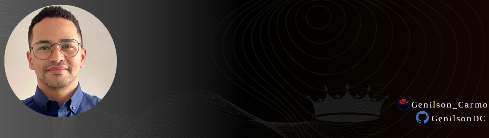
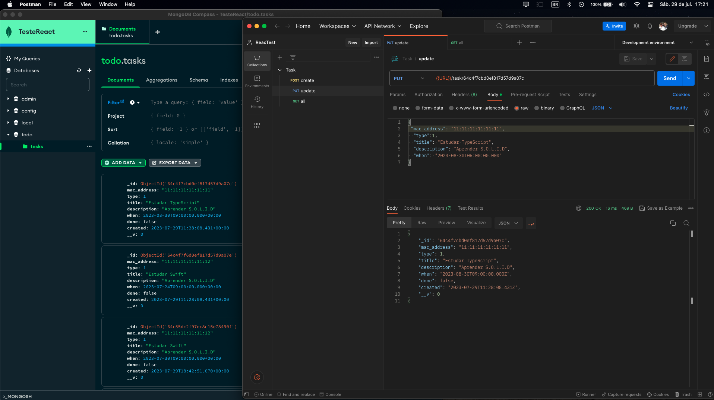

# Projeto Full Stak WEB  e Mobile com React  , Native e MongoDB 

> ### O objetivo deste app é implementar o MVC design pattern e adiquirir experiencia com o React, React native e o NoSQL MongoDB
>
> ### Testes de rota com Postman. 
>
> 

###    

        

